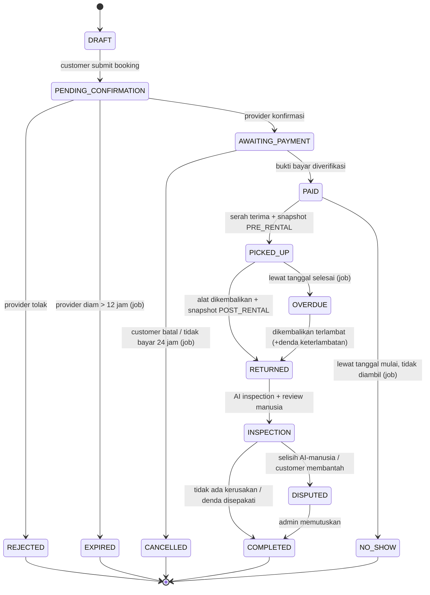
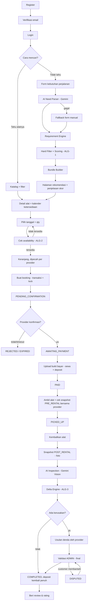
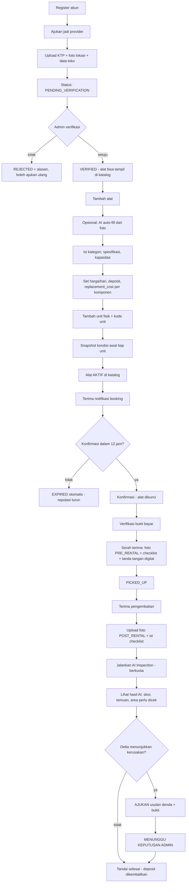
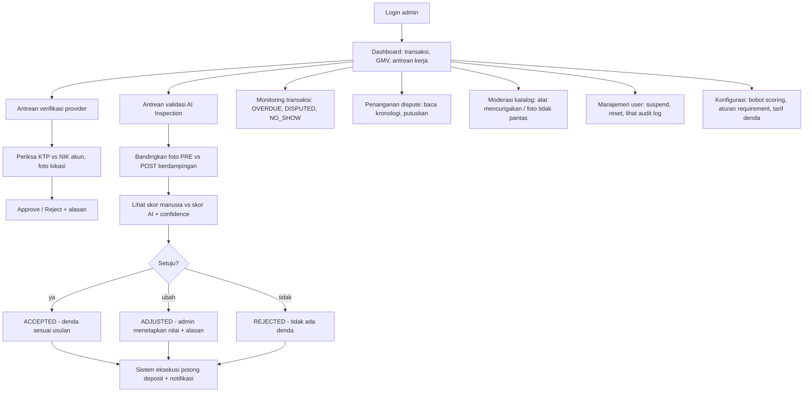
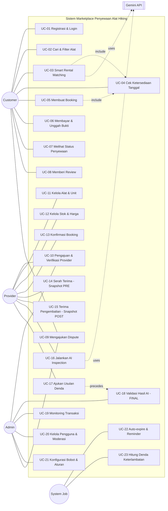

# Bagian 3: BUSINESS FLOW & USE CASE

---

## 1. STATE MACHINE TRANSAKSI (fondasi seluruh flow)

Sebelum menggambar alur, tetapkan dulu **status transaksi**. Semua alur hanyalah
perpindahan antar status ini. Dengan state machine, tidak ada status ambigu dan
Anda mudah menjawab pertanyaan penguji "kalau customer tidak datang bagaimana?".

**Aturan transisi (tegakkan di kode, bukan hanya di dokumen):**
- Transisi hanya boleh lewat satu kelas `RentalStateMachine::transition($t, $to, $actor)`.
- Setiap transisi dicatat di tabel `transaction_status_logs` (siapa, kapan, dari→ke, catatan).
- Status yang mengunci stok (menyumbang okupansi di ALG-2):
  `PENDING_CONFIRMATION, AWAITING_PAYMENT, PAID, PICKED_UP, OVERDUE, RETURNED, INSPECTION`.
  Status yang **melepas** stok: `REJECTED, EXPIRED, CANCELLED, NO_SHOW, COMPLETED, DISPUTED(selesai)`.

> Catatan: `PENDING_CONFIRMATION` **ikut mengunci stok** (soft-hold). Tanpa ini,
> 10 orang bisa membooking 1 tenda dan 9 kecewa. Karena itu harus ada job
> `EXPIRED` agar stok tidak tersandera selamanya.

---

## 2. FLOW CUSTOMER

**Detail penting yang sering dilupakan:**
- Customer **wajib melihat dan menyetujui snapshot PRE_RENTAL** saat pengambilan
  (tombol "Saya setuju kondisi alat sesuai foto"). Tanpa persetujuan ini,
  provider tidak bisa mengklaim kerusakan. Ini fitur kecil tapi menyelesaikan
  masalah bisnis terbesar — tekankan di presentasi.
- Keranjang lintas provider **dipecah menjadi beberapa transaksi** (satu per
  provider), karena konfirmasi, pembayaran, dan pengambilan terpisah.
- Denda keterlambatan: `denda = hari_terlambat × tarif_harian × 1,5` (deterministik).

---

## 3. FLOW PROVIDER

> **Provider tidak pernah bisa memotong deposit sendiri.** Provider mengajukan,
> admin memutuskan, sistem mengeksekusi. Ini pembatas kekuasaan yang membuat
> marketplace layak dipercaya.

---

## 4. FLOW ADMIN

**Prioritas antrean admin** (agar dashboard berguna, bukan sekadar cantik):
1. `DISPUTED` (ada uang tertahan)
2. AI inspection `DISCREPANCY` atau `LOW_CONFIDENCE`
3. AI inspection `CONSISTENT` (bisa disetujui massal — *fast track*)
4. Verifikasi provider baru
5. Laporan pengguna

Fast-track inilah nilai ekonomis AI: admin tidak perlu memeriksa satu per satu
kasus yang jelas normal, cukup fokus pada kasus yang ditandai AI sebagai ragu.

---

## 5. USE CASE DIAGRAM

### 5.1 Spesifikasi use case naratif (dua yang paling kritis)

**UC-05 — Membuat Booking**
| Bagian | Isi |
|---|---|
| Aktor utama | Customer |
| Prakondisi | Login; alat status aktif; provider terverifikasi |
| Pemicu | Customer menekan "Sewa Sekarang" |
| Alur utama | 1) Pilih tanggal mulai & selesai, qty. 2) Sistem menjalankan ALG-2. 3) Sistem menghitung biaya (sewa × hari × qty + deposit − diskon durasi). 4) Customer meninjau & menyetujui syarat. 5) Sistem **membuka transaksi DB + lock baris**, mengecek ulang ketersediaan, menyimpan transaksi status `PENDING_CONFIRMATION`. 6) Notifikasi ke provider. |
| Alur alternatif | 2a) Tidak tersedia → tampilkan tanggal terdekat yang tersedia + alat alternatif berperingkat tinggi. |
| Alur eksepsi | 5a) Pengecekan ulang gagal (ada yang mendahului) → rollback, HTTP 409, minta pilih ulang. 5b) Idempotency key sudah ada → kembalikan transaksi yang sama, jangan buat baru. |
| Pascakondisi | Transaksi tersimpan, stok ter-hold, log status tercatat |

**UC-18 — Validasi Hasil AI (FINAL)**
| Bagian | Isi |
|---|---|
| Aktor utama | Admin |
| Prakondisi | Terdapat `ai_inspections.status = pending_review` |
| Alur utama | 1) Admin membuka antrean terurut prioritas. 2) Sistem menampilkan foto PRE & POST berdampingan, checklist manusia, skor AI, confidence, temuan, area perlu dicek, dan Δ. 3) Admin memilih ACCEPTED / ADJUSTED / REJECTED dan menulis alasan. 4) Sistem menyimpan keputusan + identitas admin + timestamp (**append-only, tidak bisa diedit**). 5) Sistem menghitung denda dari tabel tarif, dibatasi maksimum nilai deposit. 6) Sistem mengeksekusi pengembalian deposit dan mengirim notifikasi ke kedua pihak. |
| Aturan bisnis | AI **tidak pernah** mengubah status ini secara otomatis. Tanpa keputusan admin, transaksi tidak dapat mencapai `COMPLETED` bila Δ > 3. |
| Pascakondisi | Transaksi `COMPLETED` atau `DISPUTED`; `condition_score` unit diperbarui |
