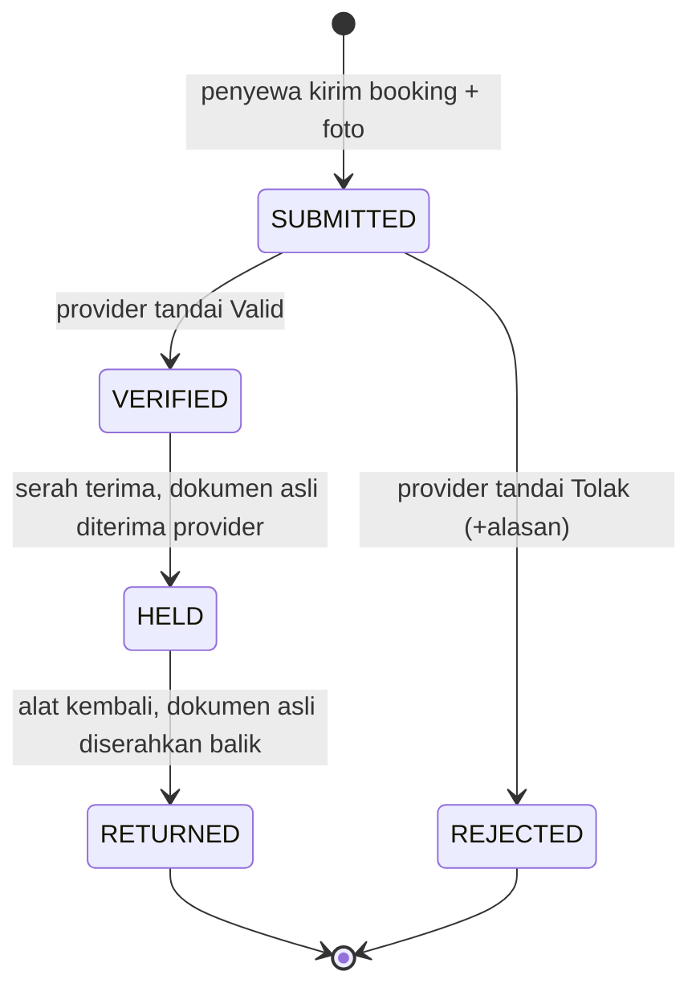

# Bagian 7: JAMINAN SEWA (KTP, IJAZAH, DLL.)

---

## 1. RINGKASAN

Setiap sewa **wajib memakai jaminan dokumen** milik penyewa, misalnya KTP, SIM,
KTM, Kartu Keluarga, ijazah, paspor, NPWP, atau BPKB. Jaminan melengkapi
deposit uang: deposit menutup kerusakan kecil, dokumen asli menekan risiko
alat dibawa kabur.

Alurnya dua tahap:

1. **Saat booking** — penyewa mengunggah foto + nomor dokumen. Provider
   memeriksa dan menandai setiap jaminan *Valid* atau *Tolak*.
2. **Saat serah terima** — penyewa menyerahkan **dokumen asli**. Provider
   mencocokkan dengan foto, lalu dokumen dikembalikan saat alat kembali.

## 2. ATURAN BISNIS

| Aturan | Nilai default | Diatur oleh |
|---|---|---|
| Jenis dokumen yang diterima | per provider (mis. KTP, SIM, KTM, KK) | Provider |
| Jumlah minimum sewa biasa | 1 | Provider (1–3) |
| Jumlah minimum sewa bernilai tinggi | 2 | Provider (1–3) |
| Batas "bernilai tinggi" | total sewa + deposit ≥ Rp1.000.000 | Provider |
| Maksimum jaminan per booking | 3 | Sistem |
| Satu jenis dokumen hanya boleh dipakai sekali per booking | — | Sistem |
| Nama di dokumen = nama akun penyewa | — | Sistem |
| NIK (KTP) dan No. KK harus 16 digit angka | — | Sistem |
| Foto dokumen wajib | — | Sistem |

Validasi dijalankan di aplikasi (umpan balik cepat) **dan wajib diulang di
server**. Implementasi acuan: `GuaranteePolicy.validate()` di
`rentgear_app/lib/domain/guarantee.dart`.

## 3. STATUS JAMINAN DAN KAITANNYA DENGAN STATE MACHINE TRANSAKSI



Guard pada `RentalStateMachine` (transisi ditolak bila syarat tidak terpenuhi):

| Transisi transaksi | Syarat jaminan |
|---|---|
| `PENDING_CONFIRMATION → AWAITING_PAYMENT` | semua jaminan `VERIFIED` |
| `PAID → PICKED_UP` | semua jaminan `HELD` (aksi "Terima jaminan & serahkan alat") |
| `RETURNED → COMPLETED` | semua jaminan `RETURNED` (aksi "Kembalikan jaminan & selesaikan") |

Bila ada jaminan `REJECTED`, provider tidak bisa mengonfirmasi dan harus
menolak booking dengan alasan. Penyewa lalu membuat booking baru.

## 4. PERUBAHAN DATABASE

**rental_guarantees** — PK `id`
`transaction_id` FK · `type` ENUM(ktp, sim, ktm, kartu_keluarga, ijazah, paspor, npwp, bpkb) ·
`holder_name` VARCHAR(120) · `number_enc` VARBINARY (terenkripsi) ·
`number_masked` VARCHAR(32) · `photo_path` (disk privat) ·
`status` ENUM(submitted, verified, rejected, held, returned) ·
`review_note` · `reviewed_by` FK users · `reviewed_at` ·
`held_at` · `held_by` FK users · `returned_at` · `returned_by` FK users ·
`photo_purged_at` · `created_at`/`updated_at`
Index: `(transaction_id)`, `(status)`
Constraint: `UNIQUE(transaction_id, type)` — satu jenis sekali per booking.

**provider_guarantee_policies** — PK `provider_id` (1:1 dengan providers)
`accepted_types` JSON · `base_required` TINYINT · `high_value_required` TINYINT ·
`high_value_threshold` DECIMAL(12,2) · `updated_at`

Kardinalitas: `rental_transactions 1 : N rental_guarantees` (1–3).

## 5. ENDPOINT API TAMBAHAN

```
GET    /api/v1/providers/{slug}/guarantee-policy
POST   /api/v1/bookings                         (body: ..., guarantees[] multipart)
POST   /api/v1/provider/orders/{code}/guarantees/{id}/verify
POST   /api/v1/provider/orders/{code}/guarantees/{id}/reject   { note }
POST   /api/v1/provider/orders/{code}/handover                 (set semua HELD + PICKED_UP)
POST   /api/v1/provider/orders/{code}/complete                 (set semua RETURNED + COMPLETED)
PUT    /api/v1/provider/guarantee-policy
```

Kode error baru: `GUARANTEE_INVALID` (422), `INVALID_TRANSITION` (409).
Respons API **tidak pernah** mengirim nomor dokumen utuh, hanya `number_masked`.

## 6. KEAMANAN & PRIVASI (R-10 Penyalahgunaan dokumen jaminan)

Foto KTP/ijazah adalah data pribadi sensitif (UU No. 27/2022 tentang
Pelindungan Data Pribadi). Mitigasi:

- Foto disimpan di **disk privat**, diakses lewat URL bertanda tangan
  berumur pendek, hanya oleh penyewa pemilik, provider transaksi itu, dan admin.
- Nomor dokumen dienkripsi (`Crypt`), yang ditampilkan hanya 4 digit terakhir.
- Foto dihapus otomatis **30 hari setelah `COMPLETED`** (job terjadwal),
  kecuali transaksi sedang `DISPUTED`.
- Setiap akses foto dicatat di `audit_logs`.
- Aplikasi memperingatkan penyewa saat memilih dokumen yang sulit diurus
  ulang (ijazah, paspor, KK, BPKB) dan provider saat menerimanya.

**Catatan kebijakan:** Dukcapil menganjurkan KTP-el asli tidak dijadikan
jaminan karena KTP adalah dokumen negara. Karena itu provider bebas mematikan
KTP dan memakai dokumen lain (KTM, SIM, dll.). Sebutkan hal ini di laporan
sebagai risiko yang disadari.

## 7. STATUS IMPLEMENTASI

Sudah ada di aplikasi Flutter (`rentgear_app/`) dengan repository mock:
form jaminan di layar booking (kamera/galeri), verifikasi per dokumen oleh
provider, serah terima & pengembalian dokumen, pengaturan aturan jaminan
provider, jumlah jaminan dipegang di dashboard admin, serta unit test untuk
aturan dan alur lengkap.
